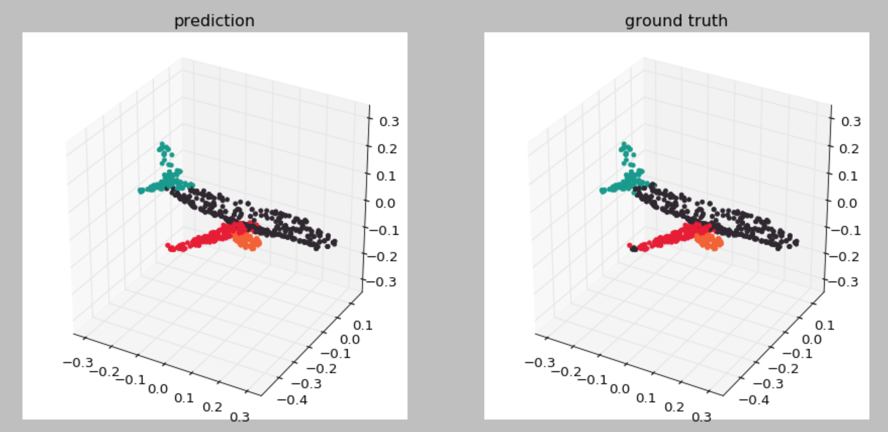
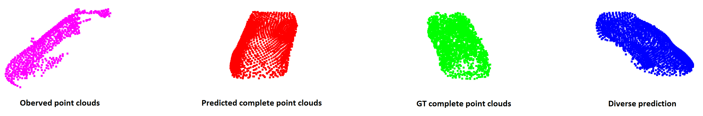

__Point Set Voting for Partial Point Clouds Analysis__
===


This paper proposes a general model for partial point clouds analysis wherein
the latent feature encoding a complete point clouds is inferred by applying a
local point set voting strategy. In particular, each local point set constructs
a vote that corresponds to a distribution in the latent space, and the optimal
latent feature is the one with the highest probability. We illustrates that this
proposed method achieves state-of-the-art performance on shape classification,
part segmentation and point cloud completion.
[[paper](https://arxiv.org/pdf/2007.04537.pdf)]
[[suppl](https://junming259.github.io/data/suppl_pointsetvoting.pdf)]


## Requirements
- Pytorch:1.5.0
- [PyTorch geometric](https://pytorch-geometric.readthedocs.io/en/latest/notes/installation.html)
- CUDA 10.1
- Tensorboard (optinoal for visualization of training process)
- open3D (optinoal for visualization of points clouds)


## Directory Structure

```
.
├── data_root
│   ├── ModelNet40 (dataset)
│   ├── ShapeNet_normal (dataset)
│   └── completion3D (dataset)
│
├── modelnet
│   ├── train_modelnet.sh
│   ├── evaluate_modelnet.sh
│   └── tensorboard.sh
│
├── shapenet_seg
│   ├── train_shaplenet.sh
│   ├── evaluate_shaplenet.sh
│   └── tensorboard.sh
│
├── completion3D
│   ├── train_completion3D.sh
│   ├── evaluate_completion3D.sh
│   └── tensorboard.sh
│
├── utils
│   ├── class_completion3D.py
│   ├── main.py
│   ├── model_utils.py
│   └── models.py
│
├── visulaization
│   ├── visualize_part_segmentation.py
│   └── visualize_point_cloud_completion.py
│
├── demo
│   ├── point_cloud_completion_demo.py
│   └── visualize.py
│
└── readme.md
```


## Shape Classification on ModelNet40
The [ModelNet40](http://modelnet.cs.princeton.edu/ModelNet40.zip) (415M) dataset
is used to perform shape classification task. We provide a [pretrained
model](https://drive.google.com/file/d/13S74g6kGHF-SKGBMVDIE39lwxsOpIPg_/view?usp=sharing),
whose accuracy on complete point clouds is 92.0% and accuracy on parital point
clouds is 85.8%. Replace the `--checkpoint` flag in `evaluate_modelnet.sh` with
the path of pretrained model.

+ Enter `completion3D/`
    ```shell
    cd completion3D/ 
    ```

+ Train the model.
    ```shell
    ./train_modelnet.sh
    ```

+ Visualize the training process in the Tensorboard.
    ```shell
    ./tensorboard.sh
    ```

+ Evaluate the trained model. Make sure that parameters in the evaluation are
  consistent with those during training.     
    ```shell
    ./evaluate_modelnet.sh
    ```


## Part Segmentation on ShapeNet


The [ShapeNet](https://shapenet.cs.stanford.edu/media/shapenetcore_partanno_segmentation_benchmark_v0_normal.zip)
(674M) dataset is used during experiments of part segmentation task. You can set
the `--categories` in ` train_shapenet.sh` to specify which categories of
objects will be trained.
We provide a [pretrained model](https://drive.google.com/file/d/1nuOIWASjD2XFmtucpqvCio_3clz2-eyR/view?usp=sharing),
whose class mean IoU (mIoU) on complete point clouds is 78.3% and mIoU on
parital point clouds is 78.3%. Replace the `--checkpoint` flag in
`evaluate_shapenet.sh` with the path of pretrained model.

+ Enter `shapenet_seg/`
    ```shell
    cd shapnet_seg/
    ```

+ Train the model.
    ```shell
    ./train_shapenet.sh
    ```

+ Visualize the training process in the Tensorboard.
    ```shell
    ./tensorboard.sh
    ```

+ Evaluate your trained model. Make sure the parameters in
  `evaluate_shapenet.sh` is consistent with those in `train_shapenet.sh`. Sample
  predicted part segmentation results are saved into:
  `shapenet_seg/checkpoint/{model_name}/eval_sample_results/`.
    ```shell
    ./evaluate_shapenet.sh
    ```

+ Visualize sample part segmentation results. After evaluation, three `.npy`
  files are saved for each sample: `pos_{idx}.npy` contains the input point
  clouds; `pred_{idx}.npy` contains the predicted part labels; `label_{idx}.npy`
  contains the ground-truth labels.
    ```shell
    cd visulaization/
    python3 visualize_part_segmentation.py --model_name {model_name} --idx {idx}
    ``` 
  


## Point Cloud Completion on Completion3D


The [Completion3D](http://download.cs.stanford.edu/downloads/completion3d/dataset2019.zip)
(1.5GB) dataset is used during experiments of point cloud completion task.
Specifically, partial point clouds are taken as inputs and the goal is to infer
complete point clouds. Note that the sythetic partial point clouds are used
during training. Download dataset and save it to `data_root/`. You can set the
`--categories` in ` train_completion3D.sh` to specify which category or
categories of object will be trained.

+ Enter `completion3D/`
    ```shell
    cd completion3D/ 
    ```

+ Train the model. 
    ```shell
    ./train_completion3D.sh 
    ```

+ Evaluate the trained model. Make sure the parameters in the evaluation are
  consistent with those during training. Sample predicted completion results are
  saved into `completion3D/checkpoint/{model_name}/eval_sample_results/`.
    ```shell
    ./evaluate_completion3D.sh 
    ```

+ Visualize point cloud completionn results. After evaluation, four `.npy` files
  are saved for each sample: `pos_{idx}.npy` contains the complete point clouds;
  `pred_{idx}.npy` contains the predicted complete point clouds;
  `pos_observed_{idx}.npy` contains the observed partial point clouds;
  `pred_diverse_{idx}.npy` contains a diverse predicted completion point clouds.
    ```shell
    cd visulaization/
    python3 visualize_point_cloud_completion.py --model_name {model_name} --idx {idx}
    ``` 
  .


## Demo 
Here we provide a quick demo for point cloud completion. Specically, the
[pretraiend model](https://drive.google.com/file/d/1K0xNJZ5NjrJW7cwHIZyCZXSJj76I5T5r/view?usp=sharing)
(pretrained only on cars from ShapeNet, and input cars are transformed to the
center of the bounding boxes) is used to do point cloud completion on partial
point clouds of vehicles generated from KITTI. The partial point cloud
generation process can be found in
[here](https://github.com/junming259/Partial_Point_Clouds_generatioin). Note
that input point clouds should be in `.npy` format and in the shape of `(N, 3)`.
For example, if your input point clouds are in the `demo/demo_inputs/*.npy` and
pretrained model is in the `demo/model_car.pth`, run the following command:

```shell
cd demo/
python3 point_cloud_completion_demo.py \
--data_path demo_inputs \
--checkpoint model_car.pth \
```

After running, predicted compeltion results will be saved in the
`demo/demo_results/`. Then visualize the results by running:

```shell
python3 visualize.py \
--data_path demo_inputs/{Input partial point clouds}.npy
```

`--data_path` can be either set to a certain point cloud, such as
`demo_inputs/000000_car_point_1.npy`, or a directory containing input
parital point clouds, such as `demo_inputs`. In the later case, a random
sample from `demo_inputs/` will be selected to visualize. 


## Citation
If you find this project useful in your research, please consider cite:
```
@article{pointsetvoting,
    title={Point Set Voting for Partial Point Cloud Analysis},
    author={Zhang, Junming and Chen, Weijia and Wang, Yuping and Vasudevan, Ram and Johnson-Roberson, Matthew},
    journal={arXiv preprint arXiv:2007.04537},
    year={2020}
}
```
