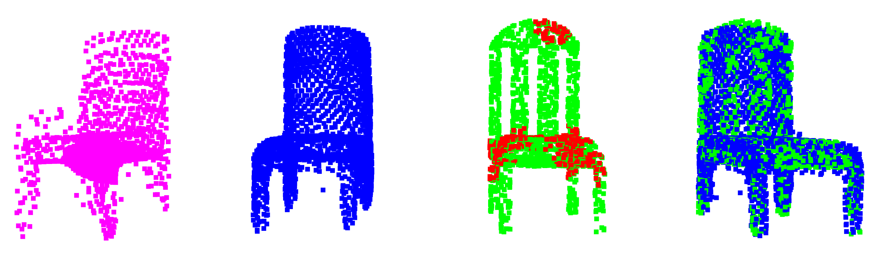

__Point Clouds Completion__
===


+ Green points are ground truth; red points are observed points; blue points are predicted points based on all observed points; pink points are predicted points based on single sub point clouds.

### Previous related works:
- [PointNet](https://arxiv.org/pdf/1612.00593.pdf)
- [PointNet++](https://arxiv.org/pdf/1706.02413.pdf)
- [FoldingNet](https://arxiv.org/pdf/1712.07262.pdf)
- [PCN](https://arxiv.org/pdf/1808.00671.pdf)

### Requirements
- Python 3.5
- Pytorch:1.4.0
- [PyTorch geometric](https://pytorch-geometric.readthedocs.io/en/latest/notes/installation.html)
- CUDA 10.1
- Tensorflow 1.14.0 (optional for visulaization during training)
- open3D (optional for visulaization of point clouds)

### Dataset
Manually download dataset and save to `data_root/`:  [ShapeNet](https://shapenet.cs.stanford.edu/media/shapenetcore_partanno_segmentation_benchmark_v0_normal.zip) (674M).
Or when running training file, it will automatically download the dataset.

To do: training model on [Completion3D benchmark](https://completion3d.stanford.edu/)

### Build docker image
For those who are familiar with docker, our code is containterized. Build docker image:
```
$ bash build.sh
```

### Training
Given the already built docker image, train the model by running:
```
$ cd completionPC/
$ bash train.sh
```

Without docker image, train the model by running:
```
$ cd completionPC/
$ CUDA_VISIBLE_DEVICES=0 python3 main.py \
--model_name cpc \
--num_pts 2048 \
--lr 0.0002 \
--step_size 250 \
--max_epoch 600 \
--bsize 8 \
--num_sub_feats 16 \
--is_subReg
```

Given the already built docker image, visualize the training process by running:
```
$ cd completionPC/
$ bash tensorboard.sh
```

### Evaluation
to do
