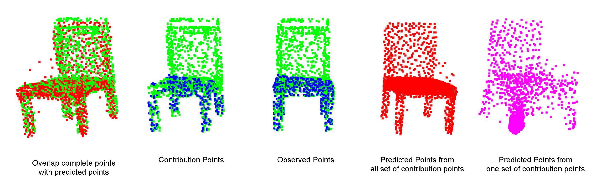

__Point Clouds Completion__
===


+ Green points are ground truth; blue points are observed points; red points are predicted points based on all observed points; pink points are predicted points based on one set of contribution points.

### Previous related works:
- [PointNet](https://arxiv.org/pdf/1612.00593.pdf)
- [PointNet++](https://arxiv.org/pdf/1706.02413.pdf)
- [FoldingNet](https://arxiv.org/pdf/1712.07262.pdf)
- [PCN](https://arxiv.org/pdf/1808.00671.pdf)

### Requirements
- Python 3.5
- Pytorch:1.4.0
- [PyTorch geometric](https://pytorch-geometric.readthedocs.io/en/latest/notes/installation.html)
- CUDA 10.1
- Tensorflow 1.14.0 (optional for visulaization during training)
- open3D (optional for visulaization of point clouds)

### Dataset
Manually download dataset and save to `data_root/`:  [ShapeNet](https://shapenet.cs.stanford.edu/media/shapenetcore_partanno_segmentation_benchmark_v0_normal.zip) (674M).
Or when running training file, it will automatically download the dataset.

To do: training model on [Completion3D benchmark](https://completion3d.stanford.edu/).
A customized dataset would be preferred. You can find an [example](https://pytorch-geometric.readthedocs.io/en/latest/_modules/torch_geometric/datasets/shapenet.html#ShapeNet) and [tutorials](https://pytorch-geometric.readthedocs.io/en/latest/notes/create_dataset.html). (Weijia)


### Build docker image
For those who are familiar with docker, our code is containterized. Build docker image:
```
$ bash build.sh
```

### Training
Given the already built docker image, train the model by running:
```
$ cd completionPC/
$ bash train_shapenet.sh
```
The model can be trained with multiple GPUs, set the ```--gpus ``` in ``` train_shapenet.sh```.

and visualize the training process by running:
```
$ cd completionPC/
$ bash tensorboard.sh
```

### Visualization
Visulize sample results:
```
$ cd visulaization/
$ python3 visualize_results_pro.py
```

### Evaluation
```
$ cd completionPC/
$ bash evaluate_shapenet.sh
```
Make sure the ```--checkpoint``` is correct in ```evaluate_shapenet.sh```

### To do
- [x] Point clouds completion on ShapeNet
- [x] Multi GPUs implementation
- [ ] Point clouds completion on Completion3D (Weijia)
- [ ] Create a dataset featuring on occlusion
