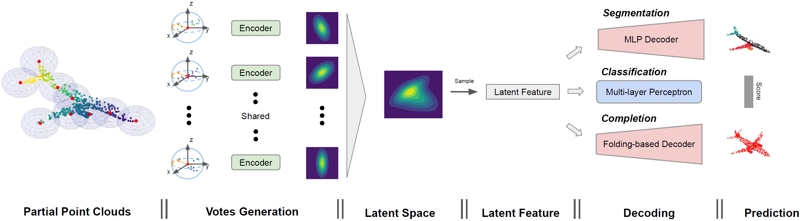
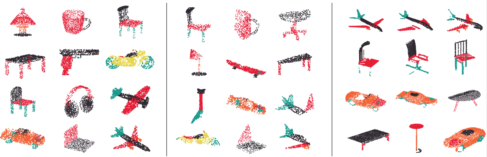
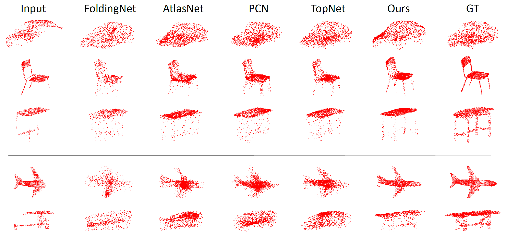

__Point Set Voting for Partial Point Clouds Analysis__
===


This paper proposes a general model for partial point clouds analysis wherein the
latent feature encoding a complete point clouds is inferred by applying a local
point set voting strategy. In particular, each local point set constructs a vote
that corresponds to a distribution in the latent space, and the optimal latent
feature is the one with the highest probability. We illustrates that this proposed
method achieves state-of-the-art performance on shape classification, part segmentation
and point cloud completion.


## Requirements
- Python 3.5
- Pytorch:1.4.0
- [PyTorch geometric](https://pytorch-geometric.readthedocs.io/en/latest/notes/installation.html)
- CUDA 10.1
- open3D (optinoal for visualization of points clouds completion)


## Directory Structure

```
.
├── data_root
│   ├── ModelNet40 (dataset)
│   ├── ShapeNet_normal (dataset)
│   └── completion3D (dataset)
│
├── modelnet
│   ├── train_modelnet.sh
│   ├── evaluate_modelnet.sh
│   └── tensorboard.sh
│
├── shapenet_seg
│   ├── train_shapelnet.sh
│   ├── evaluate_shapelnet.sh
│   └── tensorboard.sh
│
├── completion3D
│   ├── train_completion3D.sh
│   ├── evaluate_completion3D.sh
│   └── tensorboard.sh
│
├── utils
│   ├── class_completion3D.py
│   ├── main.py
│   ├── model_utils.py
│   └── models.py
│
├── visulaization
│   ├── visualize_results_pro.py
│   └── visualize_results.py
│
├── Dockerfile
├── build.sh
└── readme.md
```


## Preparation
The code is containterized. Build docker image:
```
$ bash build.sh
```


## Shape Classification on ModelNet40
The [ModelNet40](http://modelnet.cs.princeton.edu/ModelNet40.zip) (415M) dataset
is used to perform shape classification task. To do point clouds classification,
first download the ModelNet40 dataset and save it to `data_root/`.

+ Train the model. Specify which GPU devices to be used, and change `--gpus `
option in `train_modelnet.sh` to support multi-GPU training.
```shell
cd modelnet/
bash train_modelnet.sh
```

+ Visualize the training process by running Tensorboard.
```shell
cd modelnet/
bash tensorboard.sh
```

+ Evaluate the trained model. Make sure parameters in `evaluate_modelnet.sh`
is consistent with those in `train_modelnet.sh`.
```shell
cd modelnet/
bash evaluate_modelnet.sh
```


## Part Segmentation on ShapeNet



The [ShapeNet](https://shapenet.cs.stanford.edu/media/shapenetcore_partanno_segmentation_benchmark_v0_normal.zip)
(674M) dataset is used to perform part segmentation task. Download dataset and
save it to `data_root/`. You can set the `--categories` in ` train_shapenet.sh` to
specify which category or categories of object will be trained.

+ Train the model. Specify which GPU devices to be used, and change `--gpus` option
in ` train_shapenet.sh` to support multi-GPU training.
```shell
cd shapnet_seg/
bash train_shapenet.sh
```

+ Visualize the training process by running Tensorboard.
```shell
cd shapnet_seg/
bash tensorboard.sh
```

+ Evaluate your trained model. Make sure the parameters in `evaluate_shapenet.sh`
is consistent with those in `train_shapenet.sh`. Sample predicted part segmentation
results are saved into `shapenet_seg/checkpoint/{model_name}/eval_sample_results/`.
```shell
cd shapnet_seg/
bash evaluate_shapenet.sh
```

+ Visualize sample part segmentation results. After evaluation, three `.npy` files are saved
for each sample: `pos_{idx}.npy` contains the input point clouds; `pred_{idx}.npy` contains
the predicted part labels; `label_{idx}.npy` contains the ground-truth labels. The results
can be visualized by running:
```shell
cd visulaization/
python3 visualize_part_segmentation.py --model_name {model_name} --idx {idx}
``` 
Sample output can be found [here](figures/visualization_part_segmentation.png).


## Point Clouds Completion on Completion3D



+ Give a short introduction of completion3D dataset. Link to completion3D benckmark.

+ train

+ evaluation


+ Visualize sample point clouds completionn results. After evaluation, four `.npy` files are saved
for each sample: `pos_{idx}.npy` contains the complete point clouds; `pred_{idx}.npy` contains
the predicted complete point clouds; `pos_observed_{idx}.npy` contains the observed partial point
clouds; `pred_diverse_{idx}.npy` contains a diverse predicted completion point clouds. The results
can be visualized by running:
```shell
cd visulaization/
python3 visualize_point_clouds_completion.py --model_name {model name} --idx {idx}
``` 
Sample output can be found [here](figures/visualization_point_clouds_completion.png).
